# Mermaid教程收录
[时间管理、头脑风暴、阅读、会议记录神器-Mermaid](https://juejin.cn/post/6971426277261574152)  
[Mermaid英文教程](https://mermaid-js.github.io/mermaid/#/)  
[Mermaid在线编辑器](https://mermaid-js.github.io/mermaid-live-editor/)  
[Mermaid，就像用 Markdown 码字一样，高效制作简易流图](https://sspai.com/post/63055)  
## Mermaid - 流程图
### 基本结构

1.  圆角矩形 表示“开始”与“结束”
2.  矩形表示行动方案、普通工作环节用
3.  菱形表示问题判断或判定（审核/审批/评审）环节
4.  用平行四边形表示输入输出
5.  箭头代表工作流方向

### 流程图与节点的创建
graph 流程图声明 
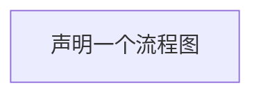
 
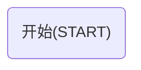
语法：id(":转义字符;")
   ```mermaid
   graph
   s("开始:#9829;")
   ```
### 各方向
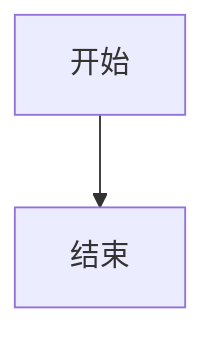

   
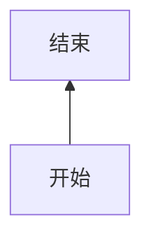

  ```mermaid
    graph LR
    s[开始]-->
    e[结束]  
  ```

```mermaid
    graph RL
    s[开始]-->
    e[结束]  
  ```
### 节点形状
   ```mermaid
    graph 
    a[矩形]
    b[圆角矩形]
	c([体育场])
	d[(圆柱)]
	e((圆形))
   ```
   ```mermaid
    graph 
	f{菱形}
	g{{六角形}}
	h>非对称]
	i[/平行四边形/]
	j[/梯形\]
   ```
### 线条形状
   ```mermaid 
    graph 
    g[开始] --- h[结束]
	a[开始] -.- b[结束]
	c[开始] === d[结束]
	e[开始] --> f[结束]
	i[开始] -.-> j[结束]
	k[开始] ==> l[结束]
   ```
### 带文字的链接线
   ```mermaid
    graph 
    a[开始] --过程1--- b[结束]
	c[开始] -->|过程2| d[结束]
	e[开始] -.过程3.-> f[结束]
	g[开始] ==过程4==> h[结束]
	
   ```
### 关系链
    
   ```mermaid
    graph LR
    s[买菜] --走路-->P[菜市场]--付钱--> e[结束买菜]
   ```
   ```mermaid
        graph LR
        s[买菜] --走路-->P[菜市场]--付钱--> e[结束买菜]
        s--走路--> o[永辉超市]--付钱--> e
   ```
    
   ```mermaid
    graph LR
    s[家] --走路-->P[菜市场]--走路-->L[水果店]--走路--> j[超市]-->s
   ```
       
   ```mermaid
        graph LR
        s[买菜] --走路-->P[菜市场]--付钱--> s
        s--网上--> o[永辉超市]--付钱--> s
   ```
#### 正常写法   
```mermaid
    graph
    z[张三]-->C[内卷]
    z-->D[躺平]
    L[李四]-->C[内卷] 
    L-->D

```
#### 简易写法
  ```mermaid
    graph
    z[张三] & L[李四]-->C[内卷] & D[躺平]
   ```
#### 不美观
  ```mermaid
    graph
    z[张三]-->X{选择躺平还是内卷}
    x--内卷-->Y[努力]
    Y--努力-->R[重新思考]
    R-->X
    X-->|躺平|N[喝快乐水]
   ```
#### 美观:加长某一项
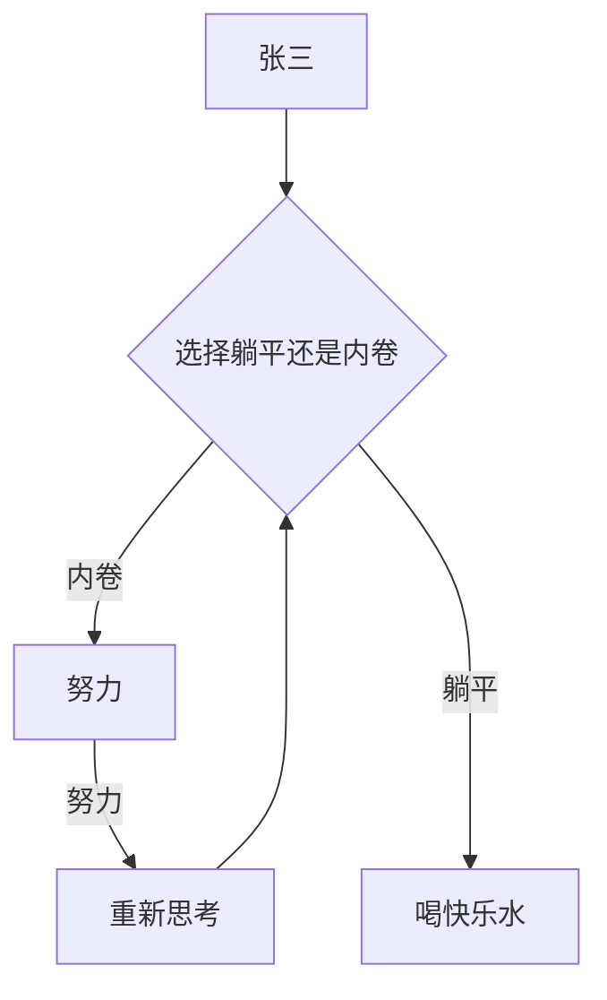
#### 增加层级:再加长
   ```mermaid
    graph
    z[张三]-->X{选择躺平还是内卷}
    x--内卷-->Y[努力]
    Y--努力-->R[重新思考]
    R-->X
    X--躺平---->N[喝快乐水]
   ```
可用----> 链接线会增加3个层级的长度 一下是各个类型连接线增加层级长度语法

增加层级长度|1|2|3
---|---|---|---
实线|---|----|-----
带箭头的实线|-->|--->|---->
粗实线|===|====|=====
带箭头的粗实线|==>|===>|====>
虚线|-.-|-..-|-...-
带箭头的虚线|-.->|-..->|-...->

### 子图表 subgraph
```markdown
graph
    节点关系
    subgraph title //子图表的名称
    子图表的节点关系
    end //子图标结束标志

```
   ```mermaid
    graph TB
        c1-->a2
        subgraph 表1
        a1-->a2
        end
        subgraph 表2
        b1-->b2
        end
        subgraph 表3
        c1-->c2
        end
   ```

### 交互
#### 为节点添加事件 以及点击跳转 这个现在还不是很好用
   
   ```javascript
     var callback = function(){
          alert('A callback was triggered');
      }
   ```
 源代码：

```
    ```mermaid
        graph LR;
            A-->B;
            B[跳转百度]-->C;
            C-->D;
            click A callback "Tooltip for a callback"
            click B "http://www.baidu.com" "This is a tooltip for a link"
            click A call callback() "Tooltip for a callback"
            click B href "http://www.github.com" "This is a tooltip for a link"
    ```
```

生成效果

   ```mermaid
        graph LR;
            A-->B;
            B[跳转百度]-->C;
            C-->D;
            click A callback "Tooltip for a callback"
            click B "http://www.baidu.com" "This is a tooltip for a link"
            click A call callback() "Tooltip for a callback"
            click B href "http://www.github.com" "This is a tooltip for a link"
   ```

#### 注释 \%\%
-   源代码
    
    ```
        ```mermaid
        graph LR
        %% this is a comment A -- text --> B{node}
           A -- text --> B -- text2 --> C
        ```
    ```
    
-   生成效果
   ```mermaid
        graph LR
        %% this is a comment A -- text --> B{node}
           A -- text --> B -- text2 --> C
   ```

### 添加样式
#### 方式1
-   语法： style id key:value,key:value
-   源代码：
    
    ```
        ```mermaid
            graph LR
            s["开始(实线边框，4px，边框颜色：#007fff 掘金蓝 ,背景色：red)"]
            e["结束(虚线边框，4px，边框颜色：red,背景色：#007fff 掘金蓝 文本颜色为白色)"]
            style s  fill:red ,stroke:#007fff,stroke-width:4px
            style e  fill:#007fff,stroke:red,stroke-width:4px,stroke-dasharray: 5 5,color:#fff
        ```
    ```
    
-   生成效果
    
    ```mermaid
        graph LR
        s["开始(实线边框，4px，边框颜色：#007fff 掘金蓝 ,背景色：red)"]
        e["结束(虚线边框，4px，边框颜色：red,背景色：#007fff 掘金蓝 文本颜色为白色)"]
        style s  fill:red ,stroke:#007fff,stroke-width:4px
        style e  fill:#007fff,stroke:red,stroke-width:4px,stroke-dasharray: 5 5,color:#fff
    ```

#### 方式2

-   1.  定义样式 class
    
    -   语法：classDef className 样式定义
-   2.  应用 :::classname
    
    -   源代码：
        
        ```
             ```mermaid
            graph LR
            s[开始]:::ownstyle-->e[结束]
            classDef ownstyle fill:#007fff,stroke:red,stroke-width:4px,stroke-dasharray: 5 5,color:#fff
            ```
        复制代码
        ```
        
    -   生成效果
     ```mermaid
    graph LR
    s[开始]:::ownstyle-->e[结束]
    classDef ownstyle fill:#007fff,stroke:red,stroke-width:4px,stroke-dasharray: 5 5,color:#fff
    ```
#### 方式3 css class形式添加样式

-   定义
```javascript
	<style>
        .cssClass > rect{
            fill:red;
            stroke:#FFFF00;
            stroke-width:4px;
        }
    </style>
```

-   实例： 源代码
    
    ```
        ```mermaid
            graph LR;
            A-->B[AAA<span>BBB</span>];
            B-->D;
            class A cssClass;
        ```
    ```
    
    生成效果：
     ```mermaid
        graph LR;
        A-->B[AAA<span>BBB</span>];
        B-->D;
        class A cssClass;
    ```
## Mermaid - 时序图（序列图）
### 基本结构

1.  `角色` Actor 系统角色 可是是人或者其他系统子系统
2.  `对象` Object 交互过程中扮演的角色 一般位于时序图顶部
3.  `生命线` Lifeline 生命线代表时序图中的对象在一段时期内的存在
4.  `控制焦点` Activation 控制焦点代表时序图中的对象执行一项活动的时期
5.  `消息` Message 定义交互和协作中交换信息的类


#### 基本对象声明
   ``` mermaid
        sequenceDiagram
        participant  张三
        participant  李四
   ```
#### 对象声明-别名 Aliases
   ``` mermaid
        sequenceDiagram
        participant  Z as 张三
        participant  L as 李四
   ```
### 消息 Message
-   语法：participant1 箭头 participant2：消息内容
   ```mermaid
    sequenceDiagram
        participant Z  as 张三 
        participant L  as  李四 
        Z->L:我是没有箭头的实线
        L-->Z:我是没有箭头的虚线
        Z->>L:带箭头的实线
        L-->>Z:带箭头的虚线
        Z-xL:带x箭头实线
        L-)Z:结束时候 带箭头的实线
        Z--)L:结束时候 带箭头的虚线
   ```
#### 线型对照表

线形|含义
---|---
->|无箭头的实线
-->|没箭头的虚线
->>|带箭头的实线
-->>|带箭头的实线
-x|带x号箭头实线
--x|结尾x号箭头实线
-)|结束 带箭头的实线
--)|结束 带箭头的虚线
  
### 控制焦点 Activations

-   语法：
    
    ```
        activate participant //激活
           消息
        deactivate participant //释放激活
    
    ```
    

这个有一些抽象我们用一个场景来去理解

#### 场景1：
    
    ```
        张三：hi李四你还好么
        // 李四听了开始回话 此时李四是激活状态 开始进行对话
        李四：hi张三我可以听到你，我很好，不用担心。
        //李四会话结束 不会再跟张三有活动 此时李四的激活状态被释放
    
    ```
    
 源代码：
        
        ```
            ```mermaid
            sequenceDiagram
            participant Z as 张三
            participant L as 李四
            Z->>L:hi李四你还好么
             activate L
            L->>Z:hi张三我可以听到你，我很好，不用担心。
            deactivate L
            ```
        
        ```
        
生成效果：
   ```mermaid
    sequenceDiagram
    participant Z as 张三
    participant L as 李四
    Z->>L:hi李四你还好么
     activate L
    L->>Z:hi张三我可以听到你，我很好，不用担心。
    deactivate L
   ```
#### 场景2：

```
    张三：hi李四你还好么
    张三：你可以听到我说话么 
       //李四开始回话 被激活
    李四：hi张三我可以听到你 
    李四：不用担心我
复制代码
```

-   源代码：
    
    ```
        ```mermaid
        sequenceDiagram
        participant Z as 张三
        participant L as 李四
    
        Z->>L:hi李四你还好么
         activate L
        Z->>L:你可以听到我说话么
         activate L
        L->>Z:hi张三我可以听到你
         deactivate L
        L->>Z:我很好，不用担心。
         deactivate L
        ```
    
    ```
    
-   生成效果：
    ```mermaid
    sequenceDiagram
    participant Z as 张三
    participant L as 李四

    Z->>L:hi李四你还好么
     activate L
    Z->>L:你可以听到我说话么
     activate L
    L->>Z:hi张三我可以听到你
     deactivate L
    L->>Z:我很好，不用担心。
     deactivate L
    ```
### 时序图-批注 Note

-   语法：
    -   单个对象：
        
        Note 位置 of participant:批注内容
        
    -   多个对象：
        
        Note 位置 角色名称1，角色名称2:批注内容
        
-   位于对象左侧：
    -   源代码
        
        ```
            ```mermaid
                sequenceDiagram
                participant 张三
                Note left of 张三 :我是张三
            ```
        复制代码
        ```
        
    -   生成效果

      ```mermaid
        sequenceDiagram
        participant 张三
        Note left of 张三 :我是张三
    ```

    ```mermaid
        sequenceDiagram
        participant 张三
        Note right of 张三 :我是张三
    ```

    ```mermaid
        sequenceDiagram
        participant 张三
        participant 李四
        Note over 张三,李四 :我是张三
    ```
	
### 时序图-逻辑循环 Loop

交互过程中表示某些循环的环节

-   语法：
    
    ```
        loop 循环描述
        循环内容
        end //结束标记
    复制代码
    ```
    
-   场景：

李四跟张三是好朋友 李四生病了 张三很关心他 每过一小时 为了不让张三如此担心 李四就约定每一个小时给张三发消息

-   源代码：
    
    ```
         ```mermaid
            sequenceDiagram
            participant 张三
            participant 李四
            张三->>李四:李四你好么
            loop 每过一小时李四发消息给张三
                 李四 --> 张三:我很好
            end
        ```
    复制代码
    ```
    
-   生成效果：
    
     ```mermaid
        sequenceDiagram
        participant 张三
        participant 李四
        张三->>李四:李四你好么
        loop 每过一小时李四发消息给张三
             李四 --> 张三:我很好
        end
    ```

### 时序图 抉择（Alt）&选项（Opt）

组合片段用来解决交互执行的条件及方式。它允许在序列图中直接表示逻辑组件，用于通过指定条件或子进程的应用区域，为任何生命线的任何部分定义特殊条件和子进程。

#### Alt 抉择

用来指明在两个或更多的消息序列之间的互斥的选择，相当于经典的`if..else..` 只能发生一种情况

-   语法：

```
    alt 第一种情况描述
        具体发生的动作
    else 剩余情况描述
        具体发生的动作
    end
复制代码
```

-   场景：
    
    ```
        场景:张三：李四你还好么
        如果李四生病了他会说：我不是很好
        如果李四很健康他会说：我很好 又是很好的一天
    复制代码
    ```
    
    -   源代码：
        
        ```
            ```mermaid
                sequenceDiagram
                participant 张三
                participant 李四
                张三 ->>李四:你生病了么
                alt 第一种情况描述
                    李四-->>张三:是的，我很难受
                else 剩余情况描述
                    李四-->>张三:我没生病，挺好的
                end
            ```
        复制代码
        ```
        
    -   生成效果：

    ```mermaid
        sequenceDiagram
        participant 张三
        participant 李四
        张三 ->>李四:你生病了么
        alt 第一种情况描述
            李四-->>张三:是的，我很难受
        else 剩余情况描述
            李四-->>张三:我没生病，挺好的
        end
    ```

#### opt 选择"

包含一个可能发生或不发生的序列 就是一种场景有可能发生也有可能不发生

-   语法：
    
    ```
        opt 情况描述
            有可能发生的动作
        end
    复制代码
    ```
    
-   场景：
    
    ```
        场景:张三：李四你还好么
        李四会可能会说谢谢你的问候也可能不会说 这个并无法预测
    复制代码
    ```
    
    -   源代码：
        
        ```
            ```mermaid
                sequenceDiagram
                participant 张三
                participant 李四
                张三 ->>李四:你还好么
                opt 可能的回答
                    李四-->>张三:谢谢你的问候
                end
            ```
        复制代码
        ```
        
    -   生成效果：

    ```mermaid
        sequenceDiagram
        participant 张三
        participant 李四
        张三 ->>李四:你还好么
        opt 可能的回答
            李四-->>张三:谢谢你的问候
        end
    ```

### 时序图 并行关系 par

#### 并行处理:
一个对象同时发出的交互动作

-   基本语法：
    
    ```
        par 动作描述1
        participant1 ->> participant2: 内容
        and 动作描述2
        participant1 ->> participant3: 内容
        end
    复制代码
    ```
    
    -   场景：
        
        ```
            participants: 张三  李四 王五
            张三 在下午5点分别给李四和王五分一条信息：内容是吃了么
            李四回复：吃了
            张三回复：没吃
        复制代码
        ```
        
        -   源代码
            
            ```
                ```mermaid
                sequenceDiagram
                    autonumber
                    participant 张三
                    participant 李四 
                    participant 王五
                    par [给李四发消息]
                    张三 ->> 李四: 吃了么
                    and [王五发送消息] 
                    张三 ->> 王五: 吃了么
                    end
                    李四 ->> 张三:没吃呢
                    王五 ->> 张三:吃了
            
                ```
            复制代码
            ```
            
        -   生成效果

  
    ```mermaid
    sequenceDiagram
        autonumber
        participant 张三
        participant 李四 
        participant 王五
        par [给李四发消息]
        张三 ->> 李四: 吃了么
        and [王五发送消息] 
        张三 ->> 王五: 吃了么
        end
        李四 ->> 张三:没吃呢
        王五 ->> 张三:吃了

    ```

#### 嵌套语法：

```
    par 动作描述1
    participant1 ->> participant2: 内容
    and 动作描述2
    participant1 ->> participant3: 内容
    end
    par 动作描述1
     participant3 ->> participant4:内容
     and 王五发消息给A8
     participant3 ->> participant5:内容
     end
复制代码
```

-   场景：
    
    ```
        participants: 张三  李四 王五 赵六 A8
        王五明天请吃饭
        张三发消息问李四明天去不去 同时发消息给王五问明天都有哪些人参加
        王五发消息给赵六:明天一起吃饭8 同事也发消息给A8告诉他让他带着小伙伴一起
    复制代码
    ```
    
    -   源代码
        
        ```
            ```mermaid
            sequenceDiagram
             participant 张三
             participant 李四 
             participant 王五
             participant 张三
             participant 赵六
             participant A8
             par  张三发消息给李四
                 张三 -->> 李四:明天王5请客吃饭
             and 张三发消息给王五
                 张三 -->> 王五: 明天吃饭都有谁呢
             end
             par 王五发消息给赵六
                 王五->>赵六:明天准时到场哈
             and 王五发消息给A8
                 王五 ->>A8:明天带上你的伙伴一起来哈
             end
        
            ```
        复制代码
        ```
        
    -   生成效果

      ```mermaid
    sequenceDiagram
     participant 张三
     participant 李四 
     participant 王五
     participant 赵六
     participant A8
     par  张三发消息给李四
         张三 -->> 李四:明天王5请客吃饭
     and 张三发消息给王五
         张三 -->> 王五: 明天吃饭都有谁呢
     end
     par 王五发消息给赵六
         王五->>赵六:明天准时到场哈
     and 王五发消息给A8
         王五 ->>A8:明天带上你的伙伴一起来哈
     end

    ```
#### 背景高亮

-   语法：
    
    ```
        rect rgba(0,213,123)
    复制代码
    ```
    
-   源代码：
    
    ```
        ```mermaid
        sequenceDiagram
         participant 张三
         participant 李四 
         participant 王五
         participant 张三
         participant 赵六
         participant A8
         par  张三发消息给李四
              rect rgba(0,113,133)
             张三 -->> 李四:明天王5请客吃饭
                end
    
         and 张三发消息给王五
              rect rgba(0,113,133)
             张三 -->> 王五: 明天吃饭都有谁呢
        end
         end
    
         par 王五发消息给赵六
          rect rgba(0,213,123)
             王五->>赵六:明天准时到场哈
                 end
         and 王五发消息给A8
         rect rgba(0,213,123)
             王五 ->>A8:明天带上你的伙伴一起来哈
        end
         end
    
    
        ```
    复制代码
    ```
    
-   生成效果：
    
    ```mermaid
    sequenceDiagram
     participant 张三
     participant 李四 
     participant 王五
     participant 张三
     participant 赵六
     participant A8
     par  张三发消息给李四
          rect rgba(0,113,133)
         张三 -->> 李四:明天王5请客吃饭
            end

     and 张三发消息给王五
          rect rgba(0,113,133)
         张三 -->> 王五: 明天吃饭都有谁呢
    end
     end

     par 王五发消息给赵六
      rect rgba(0,213,123)
         王五->>赵六:明天准时到场哈
             end
     and 王五发消息给A8
     rect rgba(0,213,123)
         王五 ->>A8:明天带上你的伙伴一起来哈
    end
     end


    ```

## 类图

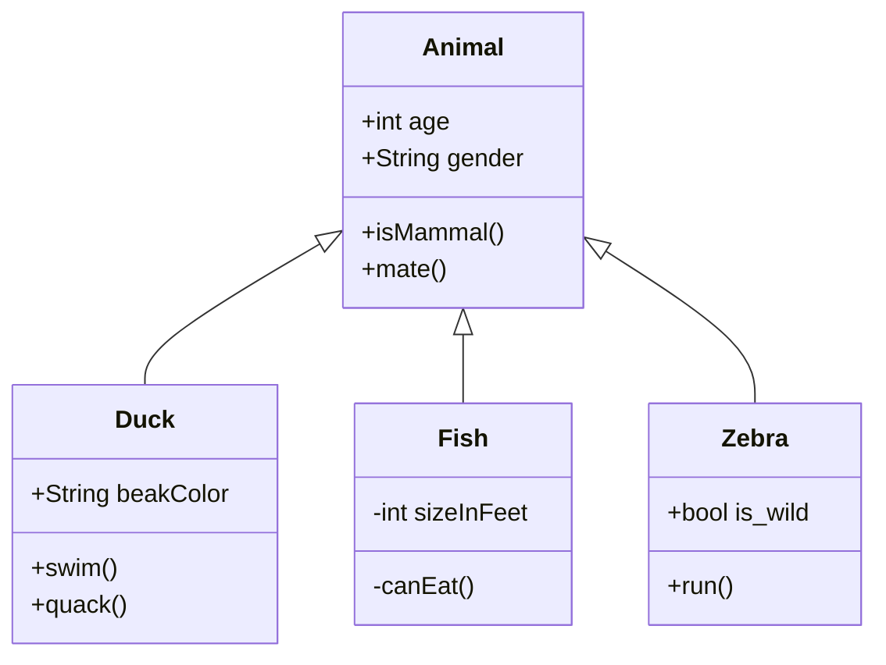
## 状态图


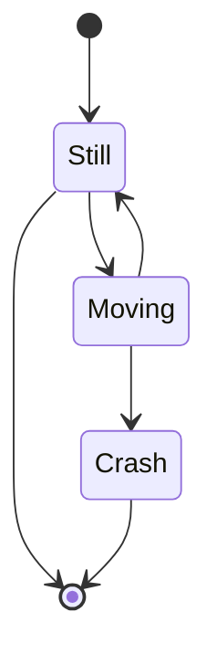
##  实体关系图

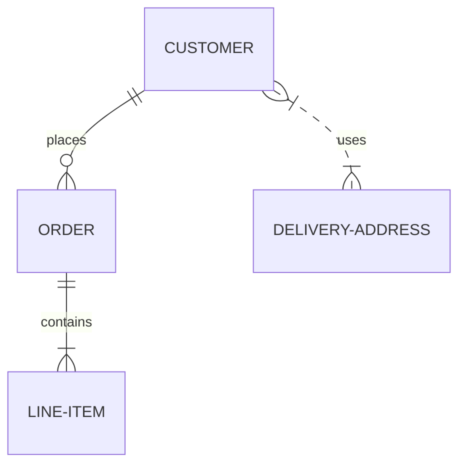
## 用户旅程图


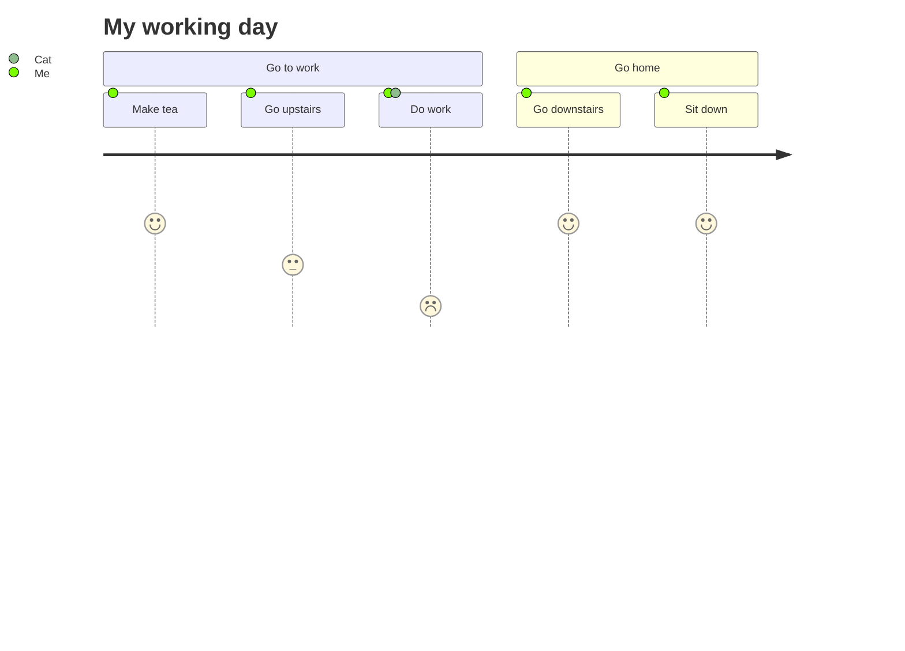
## gantt图
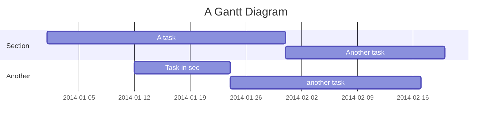
## 饼图
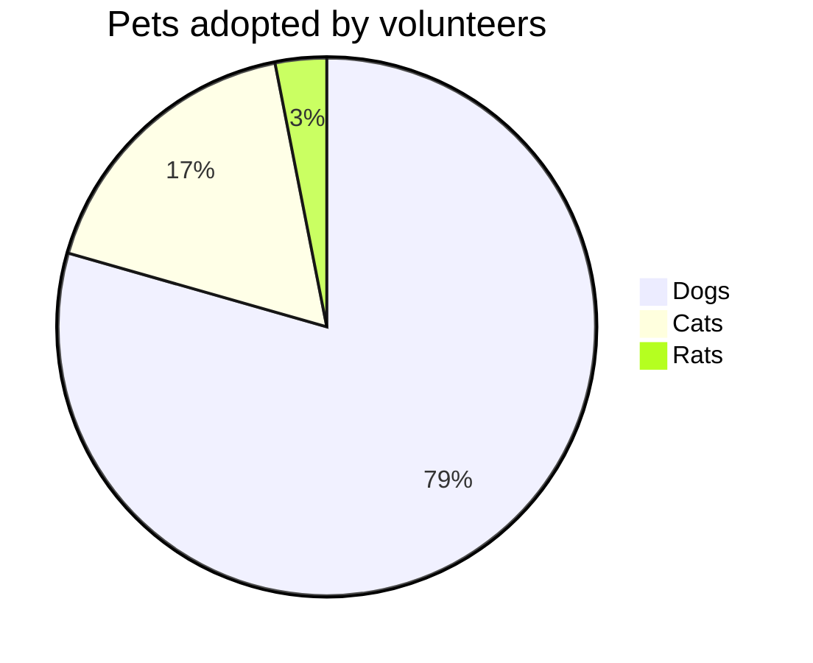
## 需求图

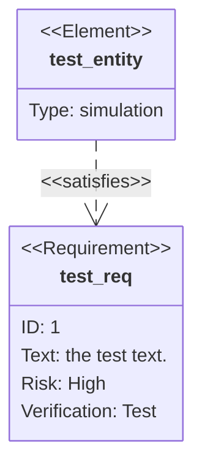