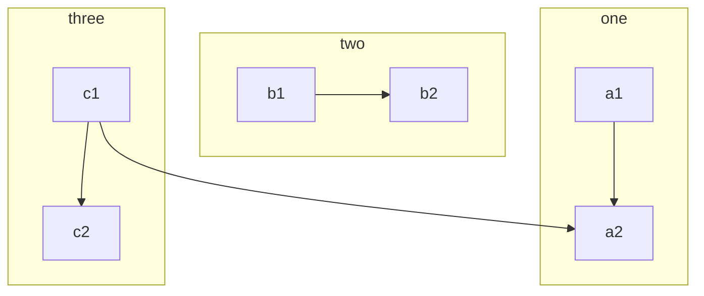

# sublimetext常见问题2

[下载安装](https://www.sublimetext.com/)  
[汉化](https://github.com/zam1024t/LocalizedMenu#submit-a-language)  
1.点击tools---install package control  
2.preferences---package control  
3.选择 “Package Control: Install Package”   
4.搜索LocalizedMenu并安装  
[乱码](https://github.com/seanliang/ConvertToUTF8)  
推荐使用 Package Control 查找 ConvertToUTF8 进行自动下载安装与更新。  
[Mac使用Sublime撸C++代码](https://zhuanlan.zhihu.com/p/48384127)  
[这两款软件让你在Mac上也能写C++](https://www.macz.com/news/4883.html)

