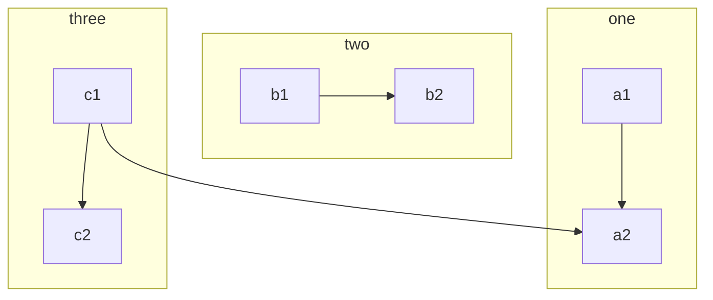

# 安装jekyll-rtd-theme博客
  

[jekyll-rtd-theme](http://themes.jekyllrc.org/jekyll-rtd-theme/)

[安装配置及写作](https://rundocs.io/)

[测试文档](https://jekyll-rtd-theme.rundocs.io/)

***
## 安装时终端出现问题的解决办法
1. 清空Gemfile文件内容
2. 终端运行 ` bundle update`
3. Gemfile文件添加以下内容
```bash
source "https://rubygems.org" # gems.ruby-china.com
gem "jekyll-rtd-theme"
gem "github-pages", group: :jekyll_plugins
```
4. 终端再次运行 ` bundle update`

***
## 一.安装
### a.基于本地主题
1.清空Gemfile文件内容,并添加以下内容

```bash
source "https://rubygems.org" # gems.ruby-china.com

gem "jekyll-rtd-theme"

gem "github-pages", group: :jekyll_plugins
```

2.将以下内容添加到您的网站 `_config.yml`

```yml
title: Your awesome title
lang: en
description: Write an awesome description for your new site here

theme: jekyll-rtd-theme
```
### b.基于远程主题
1.  将以下内容添加到您的 github 存储库 `_config.yml`

```
remote_theme: rundocs/jekyll-rtd-theme
```

2.  删除任何其他`theme`或`remote_theme`条目

## 二.设置侧边栏(子目录)
1. 在根目录新建子目录
2. 子目录中必须有一个`README.md`

**排序**
1. _config.yml中添加以下内容
```bash
readme_index:
  with_frontmatter: true
```
2. 在需要排序的文件中添加 格式头
```
---
sort: 1 # follow a certain sequence of letters or numbers
---
```

## 三.在README文件中列出文件
在README文件中添加



如果要列出子目录的所有文件则添加


## 四.语法
**思维导图**

 **笔记**
```note
这是笔记

支持 Markdown, 文本可以是**粗体**, _斜体, or ~~删除线~~. [链接](https://github.com) 是蓝色的,且没有下划线

`inline code`

[`inline code inside link`](#)
```
**提示**
```tip
它比面包盒还大..
```
**警告**
```warning
强烈的散文可能会引起极度的脑力消耗。强烈建议读者酌情决定.
```
**危险**
```danger
疯狂的科学家在工作！
```